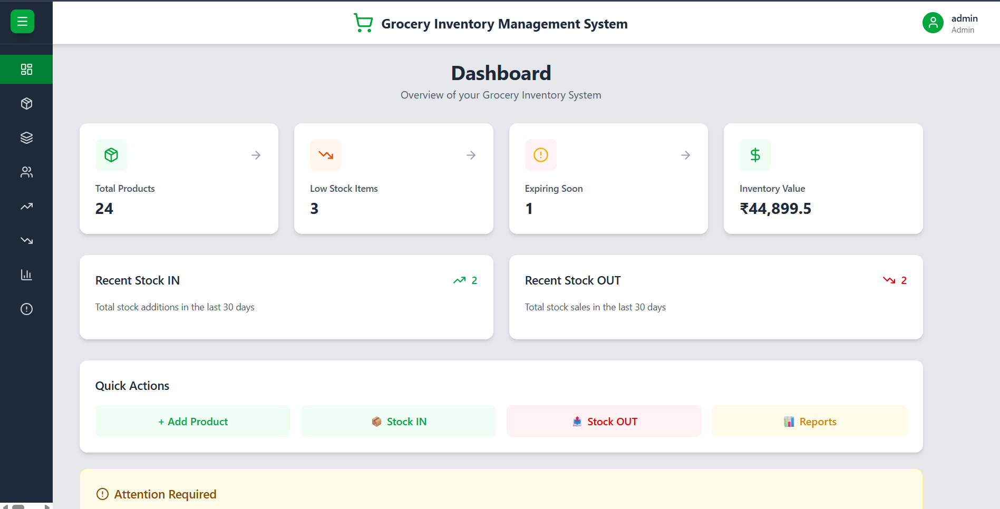
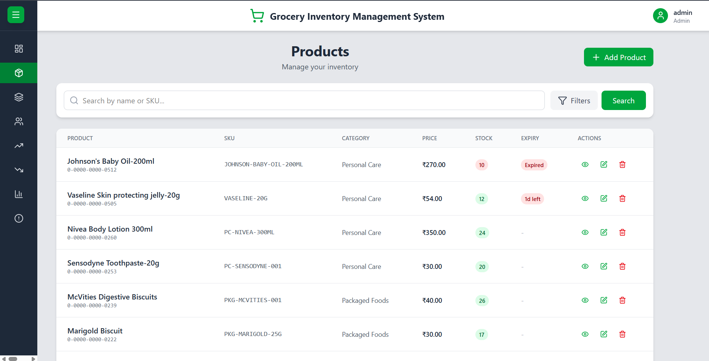
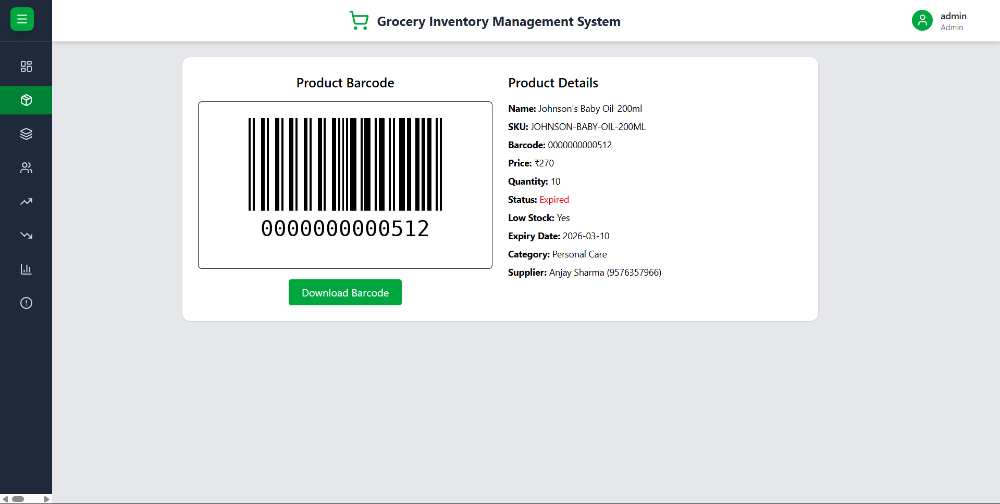

# 🛒 Grocery Inventory Management System

A full-stack Grocery Inventory Management System built using **Flask (Backend)** and **React + Vite (Frontend)**.  
The application supports authentication, inventory handling, barcode generation, and cloud-based image storage.

---

## 🚀 Live URLs

### Frontend (Netlify)

https://grocery-inventory-management-1289.netlify.app

### Backend (GCP VM)

Backend deployed on GCP VM using Gunicorn with MySQL setup, demonstrating cloud deployment and system integration.

<!-- https://grocery-inventory-management-cw3w.onrender.com -->

### Watch Video

[Working Demo](https://drive.google.com/file/d/1szD3oq2cSnQzNNh9kXOU2jTxMe-3d6h2/view?usp=sharing)

---

## 📸 Screenshots

### Dashboard



### Product Management



### Barcode Generation



---

## 🧰 Tech Stack

### Frontend

- React (Vite)
- Tailwind CSS
- Axios
- JWT Authentication
- Netlify

### Backend

- Flask
- Flask-JWT-Extended
- SQLAlchemy
- MySQL(Hosted on GCP Server)
- Gunicorn (Production Server)
- Cloudinary

---

## ⚙️ Deployment Architecture

- Frontend → Netlify
- Backend → GCP VM (e2-micro)
- Database → MySQL (same VM)
- Image Storage → Cloudinary

---

## ✨ Features

- User Authentication (JWT)
- Product & Category Management
- Barcode Generation
- Cloud Image Storage
- Inventory Tracking
- REST APIs (26 endpoints)

---

## ⚙️ Environment Variables

### Backend (.env)

```env
DB_USER=your_username
DB_PASSWORD=your_password
DB_HOST=your_host
DB_PORT=your_port
DB_NAME=your_db

SECRET_KEY=your_secret_key
JWT_SECRET_KEY=your_jwt_secret

IMAGE_STORAGE=cloud
CLOUD_BARCODE_BASE_URL=your_cloudinary_url

FRONTEND_URL=frontend_url
```

### Frontend (.env)

```env
# Backend API Base URL
VITE_API_URL=your_backend_url

# JWT Token Storage Key
VITE_TOKEN_KEY=grocery_auth_token
VITE_REFRESH_TOKEN_KEY=grocery_refresh_token
```

---

## Security

- JWT Authentication
- Environment variable based config
- CORS enabled
- Cloudinary image handling

## 👩‍💻 Author

Aasthayui

Final Year B.Tech Student
