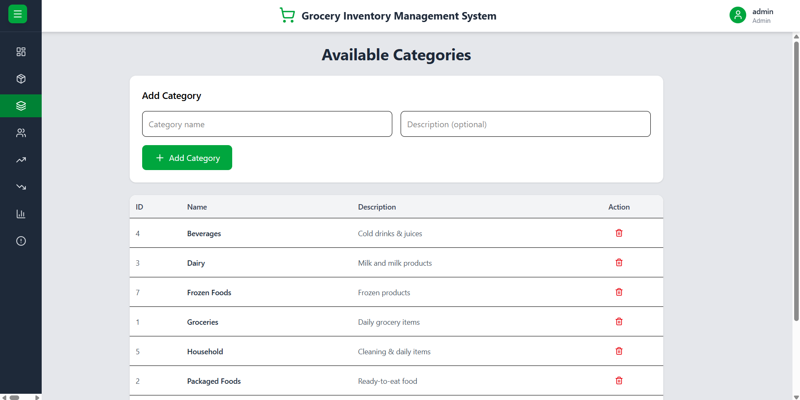
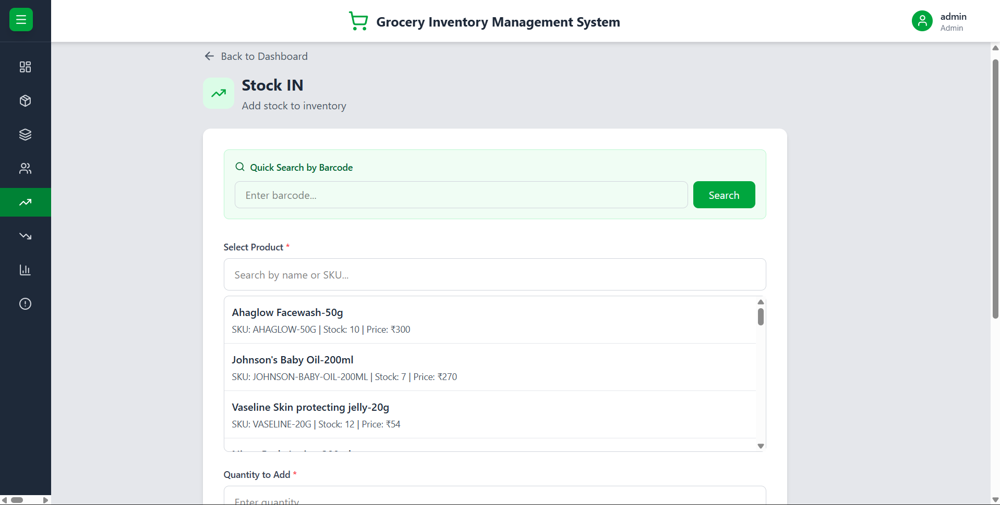
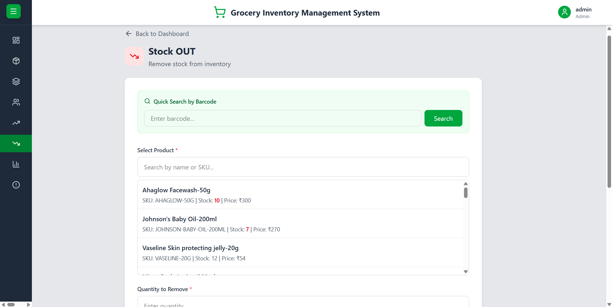
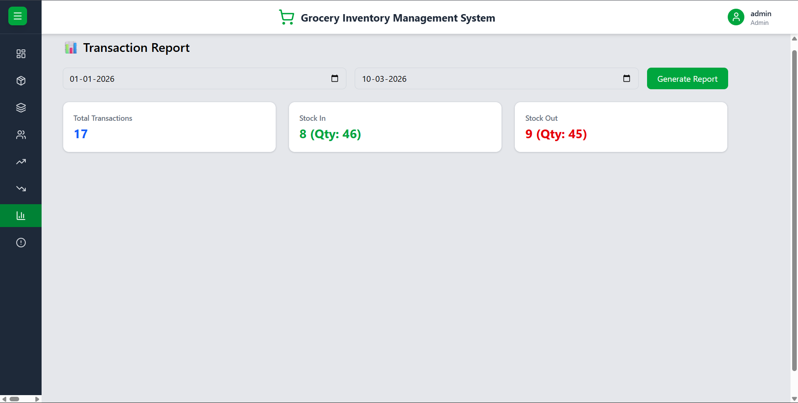
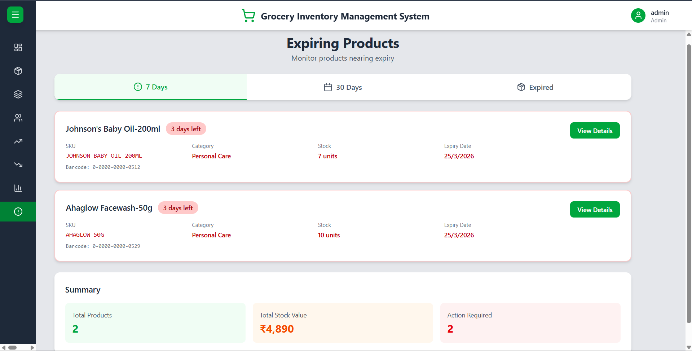

# 🛒 Grocery Inventory Management System

A full-stack Grocery Inventory Management System built using **Flask (Backend)** and **React + Vite (Frontend)**.  
The application supports authentication, inventory handling, barcode generation, and cloud-based image storage.

---

## 🚀 Live URLs

### Frontend (Netlify)

https://grocery-inventory-management-1289.netlify.app

### Backend (GCP VM)

Backend deployed on GCP VM using Gunicorn with MySQL setup, demonstrating cloud deployment and system integration.

[https://stockyz.in](https://stockyz.in)

### Watch Video

[Working Demo](https://drive.google.com/file/d/1szD3oq2cSnQzNNh9kXOU2jTxMe-3d6h2/view?usp=sharing)

---

## 📸 Screenshots

### Dashboard

### Product Management

### Barcode Generation

### Category Management

### Stock in

### Stock Out

### Transaction Reports

### Expiring products

## 

## 🧰 Tech Stack

### Frontend

- React (Vite)
- Tailwind CSS
- Axios
- JWT Authentication
- Netlify

### Backend

- Flask
- Flask-JWT-Extended
- SQLAlchemy
- MySQL(Hosted on GCP Server)
- Gunicorn (Production Server)
- Cloudinary

---

## ⚙️ Deployment Architecture

- Frontend → Netlify
- Backend → GCP VM (e2-micro)
- Database → MySQL (same VM)
- Image Storage → Cloudinary

---

## ✨ Features

- User Authentication (JWT)
- Product & Category Management
- Barcode Generation
- Cloud Image Storage
- Inventory Tracking
- REST APIs (26 endpoints)

---

## Security

- JWT Authentication
- Environment variable based config
- CORS enabled
- Cloudinary image handling

## 👩‍💻 Author

Aasthayui

Final Year B.Tech Student
